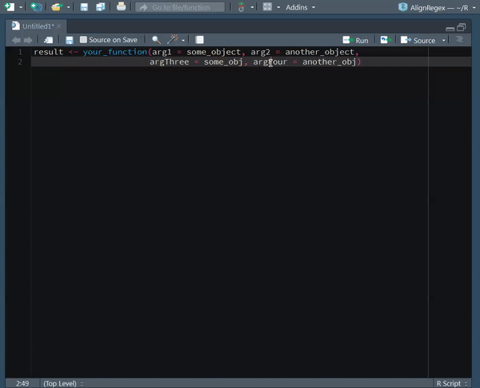

AlignRegex
==========

[](https://travis-ci.org/seasmith/AlignRegex)  <!--  -->

Overview
--------

Align either pre-defined or user-input regular expressions. This is a port of [AlignAssign](https://github.com/seasmith/AlignAssign).

Main Demo
---------



Tips
----

Use only one `\` when searching for literals.

``` r
# i.e.

# Use...
"[A-Z]+\s"

# ...instead of...
"[A-Z]+\\s"

# ...to search for a letter followed by a space.
```

Behavior of commented-out regular expressions
---------------------------------------------

Be mindful that highling a chunk of code which has assignment operators within commented lines, like the following, and running the `Align <-` addin...

``` r
# This is a commented line with an assignment operator <-
a <- 1:5
b <- 6:10
c <- 11:15
# There is an assignment operator <- here, too
```

...will result in something like this.

``` r
# This is a commented line with an assignment operator <-
a                                                      <- 1:5
b                                                      <- 6:10
c                                                      <- 11:15
# There is an assignment operator                      <- here, too
```

Not so smart aligner
--------------------

There is also no special handling of assignment operators within a function. So, if you highlighted the entire chunk below and then ran the `Align <-` addin...

``` r
var1 <- letters
var2 <- as.list(sample(1:26, 26))
names(var2) <- var1[unlist(var2)]
list.pos <- function(name, lst){
    matches <- sapply(name, function(x){
        matched <- which(names(lst) %in% x)

        if(length(matched) == 0) matched <- NA
        matched
    })
    return(matches)
}
positions <- list.pos(c("a", "bbb", "c"), var2)
```

...the result will look like this.

``` r
var1                                     <- letters
var2                                     <- as.list(sample(1:26, 26))
names(var2)                              <- var1[unlist(var2)]
list.pos                                 <- function(name, lst){
    matches                              <- sapply(name, function(x){
        matched                          <- which(names(lst) %in% x)

        if(length(matched) == 0) matched <- NA
        matched
    })
    return(matches)
}
positions                                <- list.pos(c("a", "bbb", "c"), var2)
```

Future Considerations
---------------------

-   Use [shinyalert](https://github.com/daattali/shinyalert) to handle cases where no regex match occurs, too few lines have been selected, and other errors and warnings that may occur.
